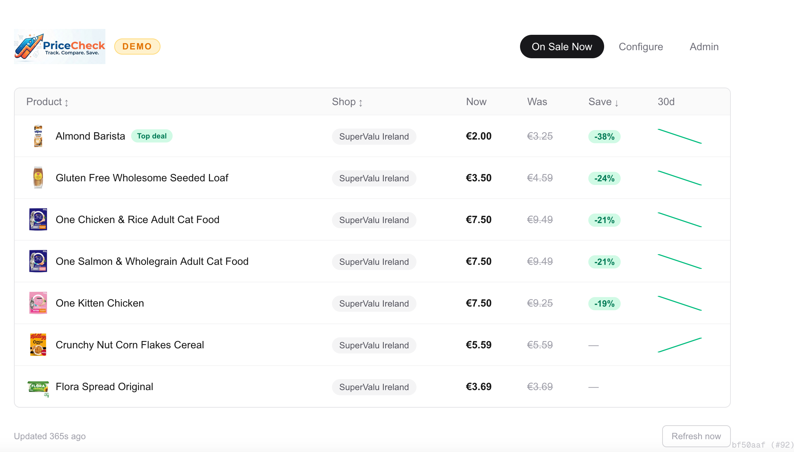
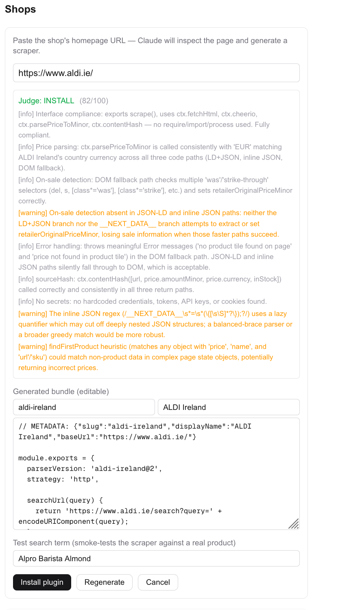

<p align="center">
  
</p>

# PriceCheck — Resilient Price-Scraping Platform

[](https://github.com/calapor/pricecheck/actions/workflows/ci.yml)

A production-shaped platform that periodically scrapes retailer sites and serves the
latest prices (and price history) for tracked products. Built as a **portfolio
project** to demonstrate end-to-end engineering — design → build → test → deploy —
delivered through an **AI-leveraged development workflow** on a modern, scalable,
resilient architecture.

> The interesting engineering here isn't the web page — it's making an *unreliable,
> adversarial* workload (scraping) dependable: decoupling the fragile scrape path from
> a fast read path, and running scrapers as a fault-isolated, horizontally-scalable
> worker fleet behind a durable queue.

📄 **Full design:** [`specs/architecture.md`](specs/architecture.md) ·
🔧 **Pipeline:** [`specs/ci-cd-pipeline.md`](specs/ci-cd-pipeline.md)

> 📸 **Screenshot:** _On Sale Now — the home page: a sortable table of currently-discounted
> grocery items (Product · Shop · Current Price · Normal Price · Reduction %) with per-row
> 30-day price sparklines._ See [`docs/screenshots/`](docs/screenshots/) for the shot list.
<!--  -->

---

> **Portfolio documentation** — AI-leveraged SDLC, prompt engineering lifecycle, scraper evaluation framework, and engineering decision log:
> 📄 [docs/portfolio/README.md](docs/portfolio/README.md)

---

## 🧭 What it does

- **Onboards any shop with AI** — paste a store URL and Claude inspects the page,
  **generates a scraper**, and an AI judge validates it before it's installed as a
  sandboxed plugin. New retailers are added without hand-writing an adapter, in any
  region or currency. See [`specs/user-flows.md`](specs/user-flows.md#add-a-new-shop-via-ai).

  > 📸 **Screenshot:** _Add a shop via AI — paste a URL, Claude generates the scraper, and
  > the AI judge returns an `install` / `warn` / `reject` verdict with findings._
  <!--  -->
- **Tracks AI spend** — an [admin dashboard](specs/user-flows.md#admin--ai-usage-dashboard)
  visualises Anthropic token usage and cost per route/operation/model over time.
- Runs scraping as a **horizontally-scalable worker fleet on Kubernetes**, decoupled from
  the read path behind a durable queue. See [`specs/architecture.md`](specs/architecture.md).
- Scrapes a configurable set of retailers on a **daily schedule**, plus **on-demand
  refresh** for hot items.
- Normalises prices to integer **minor units** + ISO-4217 currency (never floats).
- Stores current state for O(1) reads and an append-only **price history** time series.
- Serves a web UI + read API that **never blocks on a scrape** — degrades to
  "last known price + staleness badge".
- Detects **price anomalies** (a proxy for "the site changed and our parser broke").

## 🏗️ Architecture at a glance


<sub>Diagram source: [`docs/diagrams/architecture.puml`](docs/diagrams/architecture.puml) (rendered via Kroki).</sub>

- **Decoupled** read/write paths · **queue** for resilience (retries, DLQ, priority).
- **Adapter pattern** isolates each retailer's fragility behind a circuit breaker.
- **Idempotent upserts** (dedupe by content hash) make at-least-once retries safe.
- Everything self-hosts on a **Kubernetes** cluster — no managed-service lock-in.

See [`specs/architecture.md`](specs/architecture.md) for the full diagram, data model,
resilience and scalability patterns.

## 🧱 Tech stack

| Layer | Choice |
|-------|--------|
| Web / API | Next.js 16 (App Router), React 19, Tailwind 4, TypeScript |
| Data | PostgreSQL + Drizzle ORM (in-cluster StatefulSet; CloudNativePG or managed Neon in prod) |
| Queue / cache | Redis + BullMQ |
| Scraping | Per-retailer adapters + AI-generated plugins; HTTP first, **Playwright + stealth fallback** on bot-block ([ADR-0008](docs/adr/0008-headless-browser-fallback.md)) |
| AI | Anthropic Claude (scraper generate + judge), with token/cost tracking in `ai_usage` |
| Validation | Zod at every scraper boundary |
| Observability | Prometheus metrics (`prom-client`), structured logs |
| Packaging | Docker, Helm, Kubernetes (CronJob, Deployment, KEDA-ready) |
| CI/CD | GitHub Actions → GHCR → `helm upgrade`, **or** self-hosted Jenkins → in-cluster registry (arm64 Pi) |

## 📁 Monorepo layout

```
apps/
  web/            Next.js — UI, read API, on-demand refresh, /metrics, /healthz
  worker/         BullMQ consumer; per-retailer scrape pipeline
  scheduler/      enqueuer invoked by the k8s CronJob
packages/
  core/           money/price logic, product matching, anomaly detection (+ tests)
  db/             Drizzle schema, client, repository, migrations, seed
  queue/          BullMQ wrapper (queues, job types, DLQ policy)
  scrapers/       adapter interface, HTTP fetch, circuit breaker, retailer adapters
  observability/  logger + Prometheus metrics
deploy/
  docker/         web + worker Dockerfiles
  helm/pricecheck Helm chart
.github/workflows ci.yml · images.yml · deploy.yml
specs/            product-overview, architecture, data-models, user-flows,
                  ai-rules, design-system, ci-cd-pipeline, deployment, jenkins-setup
docs/adr/         architecture decision records
docs/diagrams/    PlantUML sources + rendered PNGs
prompts/          AI prompts used across the SDLC
```

## 🚀 Getting started

```bash
pnpm install

# Bring up Postgres + Redis (local), then:
cp .env.example .env            # set DATABASE_URL, REDIS_URL
pnpm db:migrate && pnpm db:seed # schema + sample retailers/products

pnpm dev                        # web at http://localhost:3000
pnpm worker                     # in another shell: process scrape jobs
pnpm scheduler                  # enqueue a scrape sweep
```

## ✅ Quality gates (all green in CI)

```bash
pnpm -r lint        # eslint
pnpm -r typecheck   # tsc --noEmit across 8 packages
pnpm -r test        # vitest (fixtures + contract + unit)
pnpm -r build       # next build (standalone)
```

## 🗺️ Status & roadmap

- [x] Monorepo, data model, queue, one reference retailer adapter, green pipeline
- [x] CI (lint/typecheck/test/build) + image build/push to GHCR
- [x] Helm chart — web/worker/scheduler + migration Job + in-cluster Postgres/Redis
      (`helm lint` + `template` + `kubectl --dry-run` verified). See [`specs/deployment.md`](specs/deployment.md)
- [x] UI + data model aligned to the on-sale wireframes (`PriceWatch.pdf`) — On Sale Now
      deals table, reference/normal price + reduction %, Configure screen
- [x] AI shop onboarding (generate → judge → sandbox) + admin AI-usage/cost dashboard
- [x] Playwright + stealth fallback for bot-protected retailers ([ADR-0008](docs/adr/0008-headless-browser-fallback.md))
- [x] Self-hosted Jenkins → in-cluster registry → Helm deploy on the arm64 Pi cluster,
      plus a seeded `pricecheck-demo` showcase release
- [ ] Grafana dashboards on the cluster metrics
- [ ] KEDA autoscaling, `price_history` partitioning, price-drop alert delivery

Full phased plan and verification steps are in [`specs/architecture.md`](specs/architecture.md).

## 📚 Documentation

| Doc | What it covers |
|-----|----------------|
| [`specs/product-overview.md`](specs/product-overview.md) | What PriceCheck is, capabilities, users, out-of-scope |
| [`specs/architecture.md`](specs/architecture.md) | Worker fleet on k8s, decoupled queue, resilience & scale |
| [`specs/data-models.md`](specs/data-models.md) | Entities, deal columns, money-as-minor-units |
| [`specs/user-flows.md`](specs/user-flows.md) | On Sale Now, Configure, **Add a shop via AI**, admin AI-usage dashboard |
| [`specs/ai-rules.md`](specs/ai-rules.md) | Engineering conventions incl. AI generate→judge loop |
| [`specs/design-system.md`](specs/design-system.md) | Brand + UI conventions |
| [`specs/ci-cd-pipeline.md`](specs/ci-cd-pipeline.md) · [`specs/deployment.md`](specs/deployment.md) · [`specs/jenkins-setup.md`](specs/jenkins-setup.md) | Pipeline & deploy |
| [`docs/portfolio/README.md`](docs/portfolio/README.md) | AI-leveraged SDLC, prompt engineering, evaluation framework, decision log |
| [`docs/adr/`](docs/adr/) | Architecture Decision Records |
| [`docs/diagrams/`](docs/diagrams/) | PlantUML sources + rendered diagrams |
| [`docs/screenshots/`](docs/screenshots/) | Shot list for the UI screenshots referenced across these docs |
