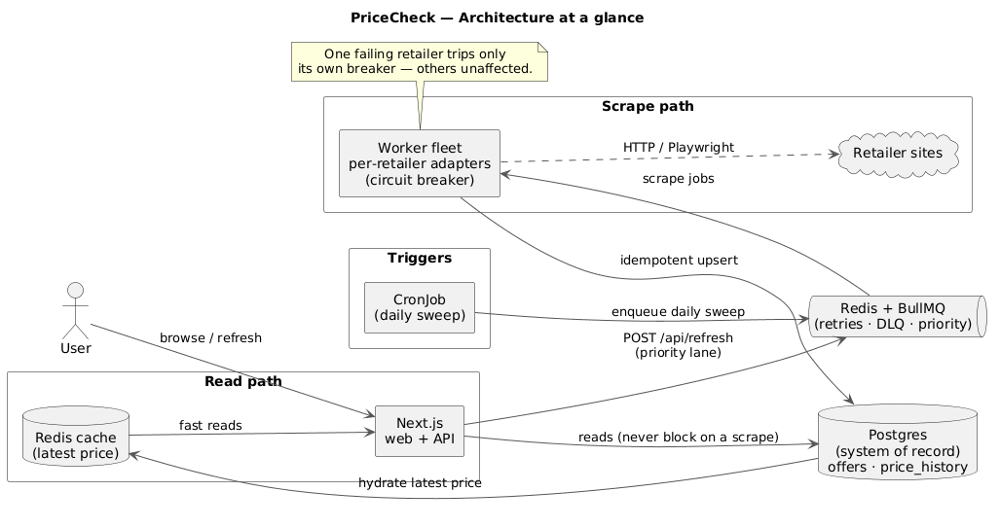
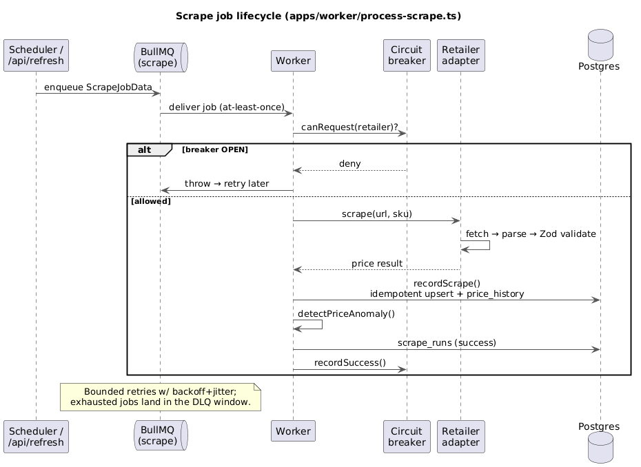

  

# Architecture

## Summary

PriceCheck periodically scrapes retailer sites and serves the latest prices + price
history for tracked products. Scraping is an unreliable, adversarial, slow I/O workload,
so the architecture is built around one principle: **decouple the fragile scrape path
from the fast read path**, and run scrapers as a fault-isolated, horizontally-scalable
worker fleet behind a durable queue.

Everything self-hosts on a **Kubernetes** cluster using native primitives — no external
managed services are required.

## Requirements that shaped it

| Dimension | Choice |
|-----------|--------|
| Scale | Small: <10 retailers, <50k SKUs, **daily** cadence |
| Scraping | **Self-host** (HTTP + Playwright + light proxy rotation); commercial APIs only as a per-retailer escape hatch |
| Infra | **Own Kubernetes cluster**, everything on-cluster |
| Freshness | Scheduled (daily) **+ on-demand refresh** for hot items |

The small scale lets us drop SQS/Fargate/QStash and express the whole system as k8s
objects. The queue is kept not for throughput but for **resilience** (retries/DLQ) and
the **on-demand priority lane**.

## Component diagram

Source of truth: [`docs/diagrams/architecture.puml`](../docs/diagrams/architecture.puml).
Observability (Prometheus metrics from web + workers, structured logs) wraps every component.

## How a scrape flows (apps/worker/src/process-scrape.ts)

Source of truth: [`docs/diagrams/scrape-flow.puml`](../docs/diagrams/scrape-flow.puml).

1. Job arrives with `ScrapeJobData` (offerId, retailer, sku, url, reason).
2. **Circuit breaker** check — if open for that retailer, fail fast so the job retries
   later instead of hammering a site that's down/blocking us.
3. The retailer's **adapter** fetches and parses the page into a validated result.
4. `recordScrape()` performs an **idempotent upsert** — updates the `offers` current
   state and appends to `price_history`, deduped by a content `source_hash`.
5. **Anomaly detection** compares to the previous price (non-positive, large spike,
   currency change) and emits a metric/log when flagged.
6. Outcome is recorded in `scrape_runs` (success/failure, attempt, duration, parser
   version). Throwing lets BullMQ apply retry/backoff; persistent failures land in the
   DLQ window.

## Data model (packages/db/src/schema.ts)

- **retailers** — name/slug, base_url, scrape strategy, rate limit, enabled.
- **products** — canonical product; title, brand, **gtin** (cross-retailer key).
- **offers** — a product *at a retailer*; holds `latest_price`, `latest_in_stock`,
  `last_scraped_at` — the O(1) row the UI reads.
- **price_history** — append-only time series (offer_id, price, in_stock, scraped_at,
  source_hash). Partition by month when it grows.
- **scrape_runs** — audit/observability per attempt.

Money is stored as integer **minor units** + ISO-4217 currency
(`packages/core/src/money.ts`) — never floats; parsed at the scraper edge, formatted
only in the UI.

## Resilience patterns

- **Retries**: exponential backoff + jitter (`DEFAULT_JOB_OPTS` in
  `packages/queue/src/scrape-queue.ts`); bounded attempts, failures retained as a DLQ window.
- **Circuit breaker per retailer** (`packages/scrapers/src/circuit-breaker.ts`): open
  after N consecutive failures, cool down, auto-probe.
- **Idempotency**: upsert keyed on offer + `source_hash`; identical re-scrapes are no-ops.
- **Politeness**: per-retailer concurrency caps; respect robots.txt + crawl-delay; jitter.
- **Graceful degradation**: UI serves last-known price + a staleness badge.
- **Validation**: Zod at every adapter boundary + anomaly checks catch parser breakage.
- **Lazy connections**: DB/queue clients connect on first use (`apps/web/src/lib`), so
  builds and cold imports never require live infra.

## Scalability patterns

- **Stateless workers** scale on queue depth (KEDA-ready) — 1–2 replicas suffice at this scale.
- **Per-retailer concurrency** so scaling out never breaches a site's rate limit.
- **Caching**: Redis latest-price cache; HTTP/CDN caching on the read API.
- **Scale-to-zero** friendly: idle cheaply between daily sweeps.

## Kubernetes mapping

| Component | k8s object |
|-----------|-----------|
| Scheduler | CronJob (daily) → `pnpm scheduler` |
| Queue/cache | Redis (chart/operator) + PVC |
| Workers | Deployment of `apps/worker` pods (+ optional KEDA ScaledObject) |
| Web/API | Deployment + Service + Ingress |
| Database | CloudNativePG cluster + backups (or managed Neon) |
| Migrations | pre-deploy Job → `pnpm db:migrate` |

The worker image (`deploy/docker/worker.Dockerfile`) is shared by worker, scheduler and
migration jobs — the manifests override the container command per role.

## Observability

Prometheus metrics from `packages/observability`: `scrape_attempts_total{retailer,outcome}`,
`scrape_duration_seconds`, `parse_failures_total`, `price_anomalies_total{kind}`, exposed
at `/api/metrics` (web) and `:9091` (workers). Alert on success-rate drops, DLQ growth,
parse-failure spikes, and freshness-SLA breaches.

## Legal / ethical guardrails

Prefer official APIs / affiliate feeds where they exist; honor robots.txt and reasonable
crawl rates; identify the bot; cache aggressively. Each retailer's ToS posture is tracked
on its `retailers` row.

## Phased roadmap

1. ✅ Foundations — monorepo, data model, migrations.
2. ✅ Vertical slice — one retailer adapter end-to-end (`books-toscrape`), reading UI.
3. ✅ Decouple via Redis/BullMQ — worker + scheduler, retries, DLQ, idempotency.
4. 🔜 Resilience & anti-bot — Playwright fallback, proxy rotation.
5. 🔜 Read-path UX — latest-price cache, history charts, price-drop alerts.
6. 🔜 Deploy & observe — Helm templates, cluster deploy, Grafana, KEDA, partitioning.

## Verification

- **Unit/contract**: adapter parsers tested against saved HTML fixtures
  (`packages/scrapers/src/adapters/__fixtures__`) — regressions caught without live sites.
- **Integration**: run the worker against local Redis + Postgres; assert rows land and
  re-runs are idempotent.
- **Resilience**: inject failures → assert retries, DLQ routing, breaker opens, read API
  still serves last-known price.
- **E2E**: scheduler enqueue → worker → UI shows price + history.
- **Pipeline**: `pnpm -r lint && pnpm -r typecheck && pnpm -r test && pnpm -r build`.
