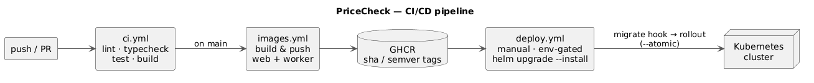

# CI/CD Pipeline

End-to-end path from a push to a running deployment, implemented with GitHub Actions →
GitHub Container Registry (GHCR) → Helm on the self-hosted Kubernetes cluster.



<sub>Source of truth: [`docs/diagrams/cicd-pipeline.puml`](../docs/diagrams/cicd-pipeline.puml).</sub>

## 1. `ci.yml` — quality gate (every push & PR)

Runs on a clean `ubuntu-latest` runner, which also proves the install is reproducible:

| Step | Command | What it guards |
|------|---------|----------------|
| Install | `pnpm install --frozen-lockfile` | lockfile integrity, deterministic deps |
| Lint | `pnpm -r lint` | eslint across all packages |
| Typecheck | `pnpm -r typecheck` | `tsc --noEmit` across 8 packages |
| Test | `pnpm -r test` | vitest: fixtures + contract + unit |
| Build | `pnpm -r build` | `next build` (standalone) compiles |

`concurrency` cancels superseded runs on the same ref. Node 22 + pnpm 11 with pnpm
store caching.

> **Note on the build:** the web app's DB/queue clients connect **lazily** (see
> `apps/web/src/lib/db.ts`, `queue.ts`), so `next build` page-data collection runs with
> no live Postgres/Redis. This is why CI can build without infra secrets.

## 2. `images.yml` — build & push images (on `main` and `v*` tags)

A matrix builds two images and pushes to GHCR:

- **web** (`deploy/docker/web.Dockerfile`) — Next.js standalone server.
- **worker** (`deploy/docker/worker.Dockerfile`) — shared by the **worker, scheduler,
  and migration** jobs; k8s overrides the container command per role.

Tags come from `docker/metadata-action`: `sha-<commit>`, the branch name, and semver on
tags. Buildx layer caching via `type=gha`. Auth uses the built-in `GITHUB_TOKEN` with
`packages: write` — no extra secrets.

## 3. `deploy.yml` — deploy to Kubernetes (manual, gated)

A `workflow_dispatch` deploy with inputs for **image tag** and **namespace**, gated on the
`production` GitHub Environment (approvals/secrets):

```
helm upgrade --install pricecheck deploy/helm/pricecheck \
  --namespace <ns> --create-namespace \
  --set image.tag=<tag> --atomic --timeout 5m --wait
```

`--atomic` rolls back automatically on a failed release. DB migrations run as a
**pre-upgrade Helm hook/Job** (`pnpm db:migrate`) so schema changes land before the new
pods start.

### Prerequisites (one-time)
- `secrets.KUBE_CONFIG` — base64 kubeconfig for the target cluster, set on the
  `production` environment.
- An `imagePullSecret` if the GHCR images are private (`values.imagePullSecrets`).

The Helm chart is implemented (`deploy/helm/pricecheck/`): web Deployment+Service+Ingress,
worker Deployment, scheduler CronJob, migration Job (post-install/upgrade hook), an env
Secret, and optional in-cluster Postgres + Redis. See [`deployment.md`](deployment.md).

## Promotion flow

1. Open a PR → `ci.yml` must pass.
2. Merge to `main` → `images.yml` publishes `sha-<commit>` images to GHCR.
3. Trigger `deploy.yml` with that tag → `helm upgrade` rolls it out (migrations first,
   atomic rollback on failure).
4. Tag `vX.Y.Z` for an immutable release image to promote the same artifact to prod.

## Self-hosted alternative: Jenkins on the cluster

The same pipeline (lint → typecheck → test → build → image → `helm upgrade`) also runs as
a **fully self-hosted Jenkins** setup on the arm64 Raspberry Pi cluster — Jenkins schedules
ephemeral Kubernetes agents, builds arm64 images with **Kaniko**, pushes to an **in-cluster
registry**, and deploys via an in-cluster ServiceAccount. No cloud, no external registry.
The pipeline lives in [`Jenkinsfile`](../Jenkinsfile); standup is in
[`jenkins-setup.md`](jenkins-setup.md). Keep this **or** GitHub Actions (or both).

## Design choices

- **One artifact, many roles**: a single worker image runs worker/scheduler/migrations,
  cutting build time and guaranteeing identical dependencies across them.
- **Lazy infra clients**: keeps CI hermetic — no databases in the build.
- **Manual, atomic deploys**: small-scale system; a human gate + auto-rollback beats
  full continuous deployment here. Easy to flip to auto-deploy-on-main later.
- **Self-hosted target**: GHCR + Helm keep everything portable to any conformant cluster.
